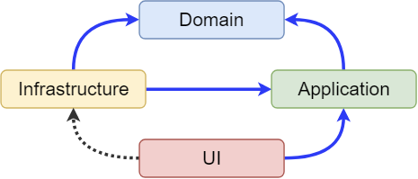

# Arquitectura por capas, mezclado con Hexagonal y DDD

La arquitectura por capas es un patrón de diseño de software

Hexagonal es un patrón de diseño de software. 
El patrón Hexagonal es una forma de estructurar el software de modo que sea independiente de los detalles de la interfaz de usuario.

Domain Driven Design (DDD) es un enfoque para el desarrollo de software que prioriza el diseño de software 
para satisfacer las necesidades de las empresas en lugar de enfocarse en la tecnología subyacente.

Se pretende hacer código mantenible y escalable en el futuro.

# UI

La capa de cliente es la capa que contiene la interfaz de usuario de la aplicación.
Puede ser una aplicación web, una aplicación móvil o una aplicación de escritorio etc..

# Domain

Este será el núcleo de la aplicación. Es la capa donde se incluyen todas las reglas de negocio
relacionadas con el problema a resolver. En esta capa; Se llevarán a cabo entidades, 
objetos de valor, agregados, factorías e interfaces.

# Application

Esta es la capa donde se manejan los flujos de procesos de negocio. 
Dependiendo de los escenarios de uso, aquí también se resuelven temas de validación de datos.

# Infrastructure

Esta capa será la capa que acceda a servicios externos como base de datos

# Dentro tenemos:

# Repository

 El patrón de diseño Repositorio separa la lógica de acceso a datos 
 de diferentes fuentes. La idea básica es crear una especie de capa 
 abstracta entre la aplicación y el almacenamiento de datos. 
 Esta capa abstracta se llama repositorio. 
 Proporciona un conjunto de métodos para que la aplicación interactúe con los datos.

 Los métodos más comunes son:
 - Guardar
 - Eliminar
 - Actualizar
 - Recuperar

 El patron de diseño de repositorio tiene una serie de ventajas:

- Aumenta la flexibilidad
- Aumenta la escalabilidad
- Aumenta la mantenibilidad

# __init__.py

Este archivo es necesario para que Python trate los directorios como paquetes.

Es una carpeta que contiene archivos de Python y un archivo __init__.py.